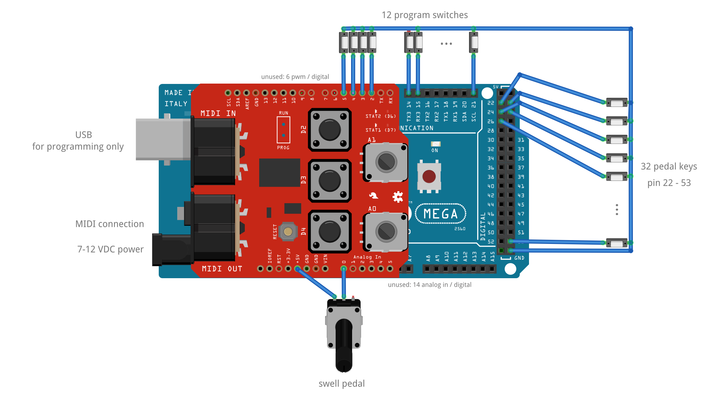
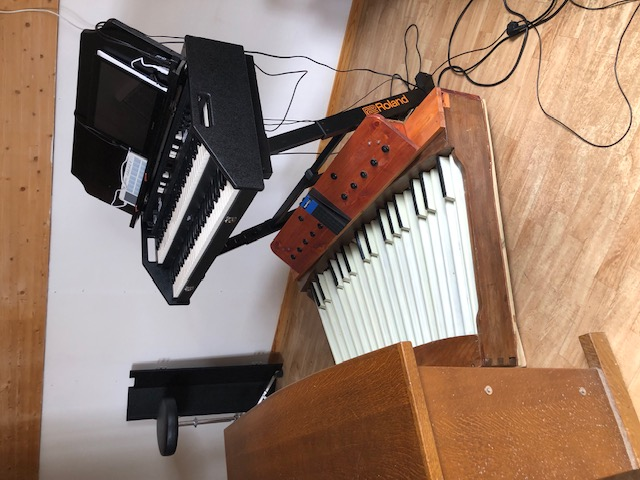
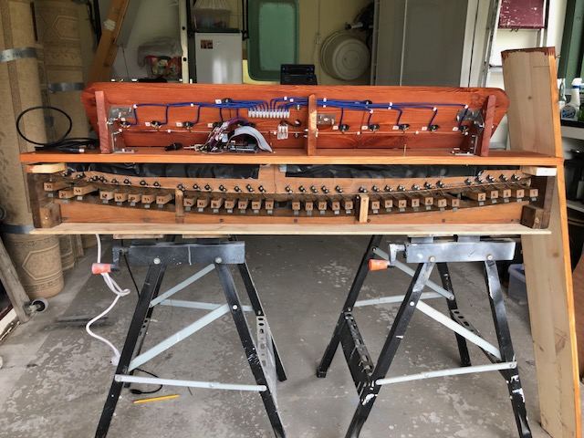

# Organ Pedalboard with Arduino

This is an Arduino sketch to MIDIfy an organ pedalboard, including foot pedal
and buttons for stops. It is meant to connect an existing pedalboard (where
each pedal key has a switch) to a virtual organ, an digital organ module or
program (like [Aeolus](https://kokkinizita.linuxaudio.org/linuxaudio/aeolus/),
[Hauptwerk](https://hauptwerk.com/) or others).

## List of materials

* Pedalboard
* Volume pedal (e.g. guitar pedal) _(optional)_
* Buttons for stops _(optional)_
* [Arduino Mega 2560](https://docs.arduino.cc/hardware/mega-2560)
* [MIDI shield](https://www.sparkfun.com/products/12898)
* Arduino power adapter (or power it from USB)
* Wires
* Virtual organ
  - physical module with MIDI in - MIDI cable
  - software program - e.g. USB-MIDI interface (may need a MIDI cable)

## Schematic

All switches are connected at one end to a pull-up input, and connect to ground
on close. The analog input for the food pedal expects a potentiometer (e.g. 10k).

Note that the MIDI output is used. When connected to a computer, it needs e.g. a
USB-MIDI adapter.

## MIDI output

### Keys

Each of the 32 pedal keys emits note on and note off messages. By default this is
on channel 3, start note C0, fixed note velocity 127.

### Pedal

By default, the panel emits control change messages on channel 3, control change
number 7 (volume).

### Stops

Stop buttons emit program change messages. By default this is on channel 3, with
control change numbers 1 to 12.

## Uploading firmware

After assembling the components, one needs to program the Arduino.

1. Open the [Arduino IDE](https://www.arduino.cc/en/software/) (install first if needed)
2. Install the _MIDI library_ from the [library manager](https://docs.arduino.cc/learn/starting-guide/software-libraries) (it is the [arduino_midi_library](https://github.com/FortySevenEffects/arduino_midi_library))
3. Open the midi sketch from the file [`organ.ino`](./organ.ino).
4. Connect the Arduino over USB to your computer.
5. Select the right Board: _Arduino Mega or Mega 2560_
6. Set the switch on the MIDI shield to `prog`
7. Select _Upload_ and wait until the process is done.
8. Set the switch on the MIDI shield to `run`

## Customizing the firmware

There are some things you may want to customize in the code:

* **Pin layout** - You can change which pins are used. This is especially useful when
  after connecting all the wires, you find that some keys are switched. Change the order
  of pin numbers in `KEY_PINS`, `DPANEL_ENCODER_PINS`, `APEDAL_PIN` or `STOPS_PINS`.
* **MIDI parameters** - You can change the MIDI channels, notes, velocity, control change
  and program change numbers. See the corresponding lines in the code.
* **Pedal type** - We've used an analog pedal, but when you have a digital panel with an
  an encoder, you can change `setup_apedal()` to `setup_dpedal()` and `loop_apedal()` to
  `loop_dpedal()` (though this has not been tested).
* **Disabling features** - If you want to disable a feature (e.g. you only want keys but no
  stops), you can comment out or remove the corresponding lines in `setup()` and `loop()`.

## Pictures

|  |  |
| --- | --- |

## Used at

* [Seljumannenmesse](https://no.wikipedia.org/wiki/Seljumannamesse) in 2023

## License

This software is distributed under the [MIT license](LICENSE).
